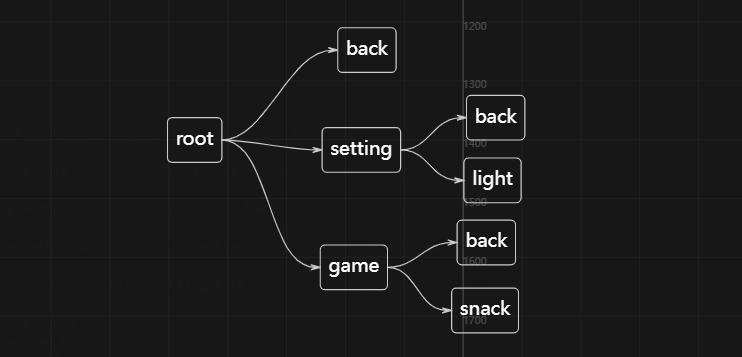
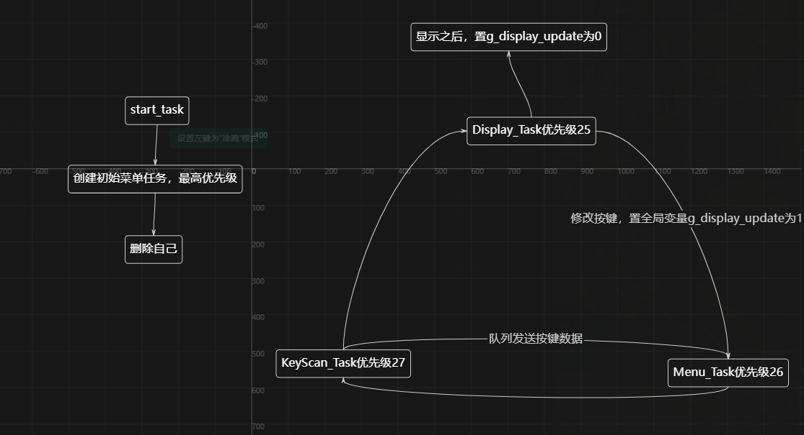

近来正在用链表和freertos做一个手表demo，权且用它来练习链表和freertos，在写的期间也遇到不少问题，其中一个就是标题写的，低优先级任务执行期间被高优先级任务抢占然后修改了低优先级任务依赖的一个全局变量，导致UI切换出现问题，这里记录一下排查过程

先说一下我的大体demo框架，使用链表构建节点树，用这个切换菜单的界面，使用freertos创建了四个任务，主任务创建完菜单后删掉自己，一个按键接收任务，一个显示任务，一个从按键接收任务的队列接收按键数据，处理节点的功能




Menu_Task接收到按键的数据后进行节点的修改，然后置g_display_update为1（这个变量我的意图是降低OLED刷新率，只有发生改变的时候才刷新），Display_Task轮询判断g_display_update是不是置为1，置为1就执行新的UI函数来刷新

然后再说我遇见的问题，程序上电在root节点，按下按键会进入子节点的back节点，同时切换到back节点的UI，但是我发现在某些时候按下按键并不会切换到back的UI，而是会暂停住当前的UI（因为root的UI有动画，所以用定时器定时刷新，所以能看出来UI暂停了），这时候再次按下按键，会直接进入setting的UI，所以可以判断是UI卡住了，但是程序是完全没有问题

在AI的帮助下，我发现问题是低优先级被高优先级任务打断，导致全局变量g_display_update被修改，但是低优先级依赖之前的全局变量g_display_update，但是它被修改了


具体描述一下情况就是，高优先级MENU_TASK任务抢占低优先级DISPLAY_TASK的任务，导致当前节点current_node被修改,进入下一个back节点，然后MENU_TASK任务进入阻塞，继续执行DISPLAY_TASK，Display_Task执行的是耗时的OLED显示操作，所以大概率MENU_TASK会在current_node->display();和OLED_Update();之间抢占显示任务，MENU_TASK切换节点到back，置g_display_update为1，然后返回来继续执行Display_Task任务，这时候会继续向下运行，然后g_display_update清零，但是节点UI显示要求g_display_update的值必须为1.由于没有节点再发生改变，然后我定时刷新写的判断逻辑是只在当前root节点刷新，所以UI就会卡在当前显示的这个界面，但是节点其实已经是下一个back节点了,简单来说就是显示了新节点但刷新标志被旧逻辑清掉

```c
Display_Task                Menu_Task
    |
判断 g_display_update == 1
    |
准备执行 current_node->display()
    |-------------------------> 抢占
                               修改 current_node 到 back
                               置 g_display_update = 1
                               阻塞
    |<-------------------------
继续执行旧逻辑
最后 g_display_update = 0
    |
UI 没刷新，卡住
```
```c
//节点结构
typedef struct node{     
    void (*display)(void);
    void (*action)(void);
    void (*move)(void);
    struct node *next;
    struct node *prev;
    struct node *father;
    struct node *child;
}Node;

// Menu_Task 收到按键后
current_node = next_node;
g_display_update = 1;

// Display_Task
if (g_display_update) {
    current_node->display();
    OLED_Update();
    g_display_update = 0;
}

// 定时器回调
if (current_node == head_node)
    g_display_update = 1;
```

治标的方法很简单，只要把Display_Task和MENU_TASK的优先级互换一下就行，不让MENU_TASK去抢占Display_Task就可以解决问题.还有一种是将g_display_update = 0;这一行提到current_node->display();之前，这样g_display_update就不会在抢占重新回来之后被清零然后导致UI卡死，但是这样只是减小被抢占的几率罢了，虽然小，但是还是有可能发生的

但是出现这个问题的原因很明显是软件设计有问题，全局变量g_display_update同时被两个任务修改，且在任务中的修改不是原子操作，可以被其他任务打断，也就是说共享变量没有做保护

（在书写裸机已经养成了全局变量满天飞的习惯，结果就是在刚入freertos就遇见了其造成的问题,老实了）

与其让两个任务共享一个标志，不如让 Menu_Task 只负责发刷新请求，Display_Task 只负责收请求然后刷新，用队列去代替全局变量，这样就避免的之前问题的发生（其实我感觉不是很妥当，任务间随意通信的话感觉任务多起来就会成为一团乱麻，但是对我现在这个demo来说还不值得考虑）

于是我就开干，在增加队列逻辑的同时，我删去了Display_Task和MENU_TASK的vTaskDelay()函数，因为使用的阻塞的队列接收逻辑，除了这个，我还把KeyScan_Task的vTaskDelay(10)替换成了1，因为我想当然的以为这个是为了进入阻塞，给其他任务让出CPU的，是为了防止高优先级一直占着把其他任务饿死，于是觉得改小点也没有关系

我在改好逻辑之后，烧录进去发现按键不好用了，点击好几下才可能进去下一个节点，然后发现短按就可以触发长按，我直接懵了，我没改按键逻辑啊，怎么会不好使了呢，我怀疑是创建的队列的问题，但是无从下手，之后竟然发现是KeyScan_Task的vTaskDelay(10)替换成了1造成了问题

大概的说一下，我的按键消抖是使用计数值来判断的，连续一段时间，就是计数值大于3才判断为短按，严重依赖外部时间，所以说KeyScan_Task的vTaskDelay(10)是为了消抖服务的，10ms正好是30ms消抖时间，改成 1ms 后，3 次只要 3ms，消抖窗口太短，所以会出现按键不灵敏的问题

至此，UI 卡死的问题告一段落了，在习惯裸机编程后，转到实时操作系统就要多考虑很多东西了，要转换思维，考虑优先级选择，变量的保护，任务间的通信的安排等很多东西，还需沉淀啊


