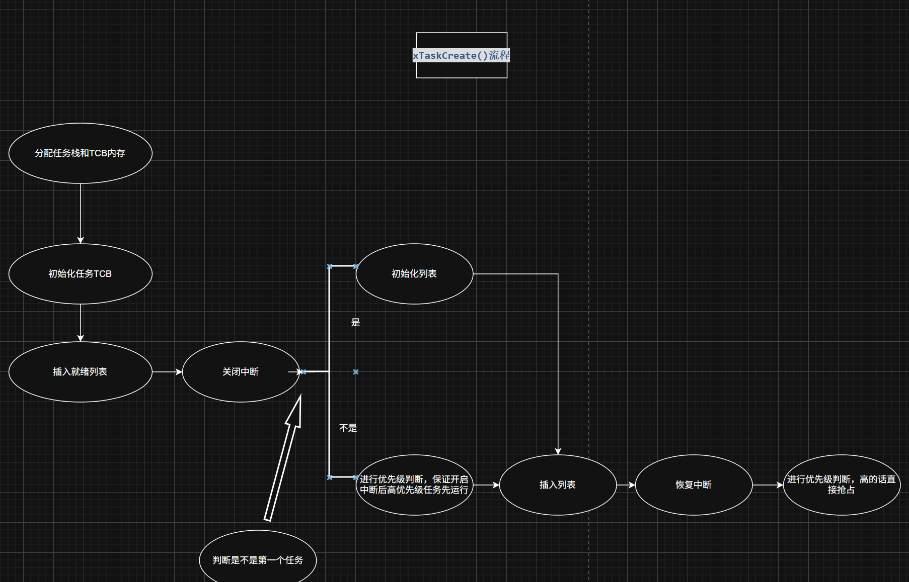

# xTaskCreate() 函数源码分析笔记


## xTaskCreate()实现
```c
BaseType_t xTaskCreate(	TaskFunction_t pxTaskCode,
							const char * const pcName,
							const configSTACK_DEPTH_TYPE usStackDepth,
							void * const pvParameters,
							UBaseType_t uxPriority,
							TaskHandle_t * const pxCreatedTask )
```

这个函数主要做了两件事：分配任务所需的内存，以及初始化任务并插入就绪列表。整个过程通过关中断保证原子性

主要通过一下几个步骤实现

### 第一步：分配内存

#### 1. 分配栈内存

```c
pxStack = pvPortMalloc( ( ( ( size_t ) usStackDepth ) * sizeof( StackType_t ) ) );
```
sizeof( StackType_t )根据架构会有不同

32位的话，你填入的栈乘上4就是栈占据的字节数

#### 2. 分配TCB内存

```c
pxNewTCB = ( TCB_t * ) pvPortMalloc( sizeof( TCB_t ) );
```

任务栈成功分配的话就接着分配TCB块的内存

#### 3. 将栈的地址保存在TCB里

```c
pxNewTCB->pxStack = pxStack;
```

栈和TCB都分配成功的话就将任务栈的地址存到TCB块中

#### 4. 标记分配类型

```c
pxNewTCB->ucStaticallyAllocated = tskDYNAMICALLY_ALLOCATED_STACK_AND_TCB;
```

FreeRTOS 支持静态和动态两种分配方式，这个字段用于在删除任务时正确释放资源

| 宏定义 | 数值 | 含义 |
| ------ | ---- | ---- |
| `tskDYNAMICALLY_ALLOCATED_STACK_AND_TCB` | 0 | **栈和TCB都是动态分配的** |
| `tskSTATICALLY_ALLOCATED_STACK_ONLY` | 1 | **栈是静态的，TCB是动态的** |
| `tskSTATICALLY_ALLOCATED_STACK_AND_TCB` | 2 | **栈和TCB都是静态分配的** |

### 第二步：初始化和插入就绪列表

```c
prvInitialiseNewTask( pxTaskCode, pcName, ( uint32_t ) usStackDepth, pvParameters, uxPriority, pxCreatedTask, pxNewTCB, NULL );
prvAddNewTaskToReadyList( pxNewTCB );
```

prvInitialiseNewTask初始化任务，填写TCB参数
prvAddNewTaskToReadyList将任务插入就绪列表

到到这里就是 xTaskCreate 的核心代码流程，可以看到这层封装主要完成了栈和 TCB 的内存分配，然后调用 prvInitialiseNewTask 初始化任务上下文，最后通过 prvAddNewTaskToReadyList 将任务插入就绪列表。而这个插入过程正是任务得以被调度器管理的关键一步，下面我们就深入剖析这个函数的实现细节

---

## prvAddNewTaskToReadyList分析

`static void prvAddNewTaskToReadyList( TCB_t *pxNewTCB )`

参数是需要插入的TCB块的地址

### 第一步：关闭中断
```c
taskENTER_CRITICAL();
```

这里可以暂时理解为关闭所有受freertos管理的中断（其实时根据配置屏蔽相应的中断，不一定是所有的），这里关闭的原因和延时函数关闭调度器的原因一样，防止列表操作过程中被打断导致列表不可用，只不过这里关闭了所有的中断，延时函数那里只关闭了调度器
（这里有一个问题，为什么新建任务时需要关闭中断，而延时只需要关闭调度器呢，不都是在操纵全局的链表吗）

### 第二步：增加任务计数

```c
uxCurrentNumberOfTasks++;
```

增加当前的任务数，一个全局计数器

### 第三步：判断是否是第一个任务

```c
if( pxCurrentTCB == NULL )
{
    pxCurrentTCB = pxNewTCB;
    if( uxCurrentNumberOfTasks == ( UBaseType_t ) 1 )
    {
        prvInitialiseTaskLists();
    }
}
```

如果pxCurrentTCB没有指向任何一个任务，就是当前没有任务运行，就会将当前任务指针pxCurrentTCB指向新创建的任务，如果这个新创建的任务是第一个任务，会调用 `prvInitialiseTaskLists();` 初始化列表

### 第四步：调度器未启动时的优先级比较

```c
if( xSchedulerRunning == pdFALSE )
{
    if( pxCurrentTCB->uxPriority <= pxNewTCB->uxPriority )
    {
        pxCurrentTCB = pxNewTCB;
    }
}
```

如果当前有任务，会先进行 `if( xSchedulerRunning == pdFALSE )` 判断调度器有没有启动，只有在不启动的时候，才会进行优先级比较来确定打开中断时运行的任务

这一步根据任务优先级，如果建立的任务优先级高于当前任务的，就将pxCurrentTCB指向新建任务，然后调度器恢复的时候运行（注意，只有在调度器关闭的时候才会这样）

### 第五步：分配任务编号

```c
uxTaskNumber++;
pxNewTCB->uxTaskNumber = uxTaskNumber;
```

任务编号+1加到给当前TCB块，这个就和创建进程，PID+1一样

### 第六步：三层处理

```c
traceTASK_CREATE( pxNewTCB );

prvAddTaskToReadyList( pxNewTCB );

portSETUP_TCB( pxNewTCB );
```

traceTASK_CREATE 是方便你加入自定义逻辑的东西

prvAddTaskToReadyList 将任务放入就绪列表

portSETUP_TCB 一个适配性的保障，在特殊架构上有用

### 第七步：恢复中断

```c
taskEXIT_CRITICAL();
```


### 第八步：抢占判断

```c
if( xSchedulerRunning != pdFALSE )
{
    if( pxCurrentTCB->uxPriority < pxNewTCB->uxPriority )
    {
        taskYIELD_IF_USING_PREEMPTION();
    }
}
```

判断调度器开没开启，如果开启的话，判断任务优先级，创建的任务如果优先级高于当前任务，直接抢占

---

## 总结

可以看到xTaskCreate实现任务内存分配，prvAddNewTaskToReadyList是为了保护，防止插入的时候被打断，主要的插入实现是靠内部的 `prvAddTaskToReadyList( pxNewTCB );` 这个宏定义来实现的。从创建到插入列表进行了两层封装，一层初始，一层保护
