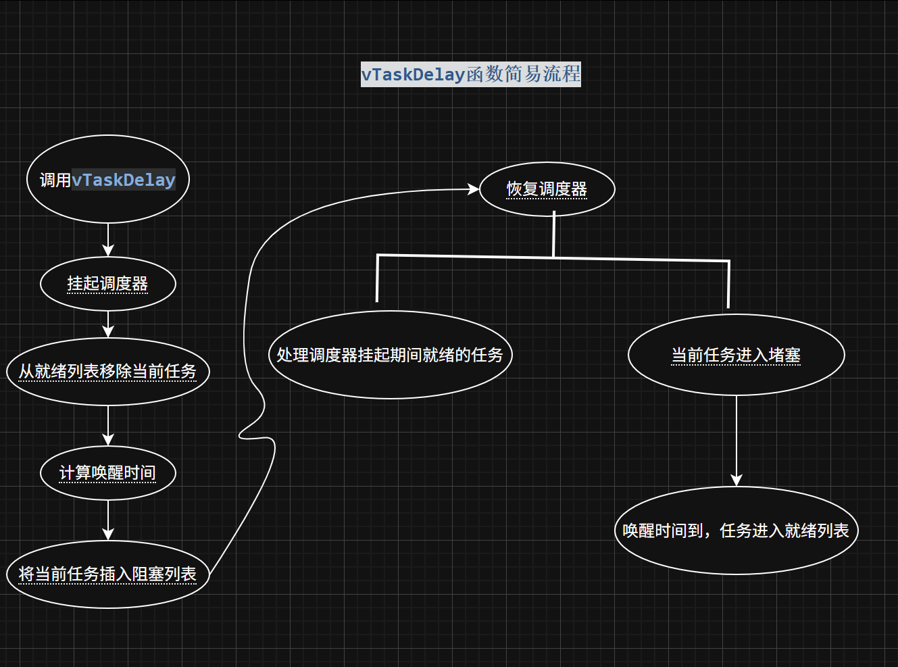

# FreeRTOS vTaskDelay 个人理解

## 一、FreeRTOS 基础概念

FreeRTOS 与电脑上常见的分时操作系统不同，是一个实时操作系统，常用于单核CPU上运行多任务

其让不同的任务看似在并行，实则是并发

FreeRTOS 进行任务调度通常依赖系统滴答定时器，需要时钟基准来合理调度 CPU，为 `vTaskDelay()` 提供延时基准

FreeRTOS 的任务存在四种状态：**就绪、挂起、阻塞、运行**

## 二、vTaskDelay 与裸机延时的区别

不同于 `HAL_Delay` 的 while 死循环（CPU 一直轮询等待延时时间到），`vTaskDelay()` 运行时，任务从就绪队列里摘除，挂到了阻塞队列里，并不是堵塞式的“延时”

想到之前在裸机写代码也写过在定时器中断里每隔多少秒置一次标志位，然后再在主函数里面根据标志位调用相关代码，然后重置标志位，目的应该类似，但实现的机制完全不一样

## 三、前置知识：TCB 与任务句柄

在了解 `vTaskDelay()` 实现机制前，首先先了解任务句柄和 TCB 的概念

### 3.1 TCB（Task Control Block，任务控制块）

任务句柄是一个指向任务控制块的指针。每一个任务都有一个 TCB，包含任务的各种信息。除了各个任务外，存在一个全局的指针指向当前任务的栈顶地址表示当前的任务，运行那个任务就指向那个任务的栈顶指针

### 3.2 TCB 结构体部分成员

| 分类 | 成员 | 说明 |
|------|------|------|
| 栈管理 | `pxTopOfStack` | 当前栈顶（任务切换关键） |
| 链表节点 | `xStateListItem` | 挂状态列表（延时/就绪/挂起） |

这里重点关注 `xStateListItem` 这个结构体，这个是实现单个任务状态切换的关键。`pxTopOfStack` 则是不同任务切换的关键

## 四、vTaskDelay 源码分析

### 4.1 完整源码

```c
void vTaskDelay( const TickType_t xTicksToDelay )
{
    BaseType_t xAlreadyYielded = pdFALSE;
    if( xTicksToDelay > ( TickType_t ) 0U )
    {
        configASSERT( uxSchedulerSuspended == 0 );
        vTaskSuspendAll();
        {
            traceTASK_DELAY();
            prvAddCurrentTaskToDelayedList( xTicksToDelay, pdFALSE );
        }
        xAlreadyYielded = xTaskResumeAll();
    }
    else
    {
        mtCOVERAGE_TEST_MARKER();
    }

    if( xAlreadyYielded == pdFALSE )
    {
        portYIELD_WITHIN_API();
    }
    else
    {
        mtCOVERAGE_TEST_MARKER();
    }
}
```

根据代码，实现延时操作是先把任务从就绪列表中拿掉，然后放入阻塞列表中，并不是简单的置一个标志位

### 4.2 核心函数：prvAddCurrentTaskToDelayedList
首先来看 prvAddCurrentTaskToDelayedList( xTicksToDelay, pdFALSE );，这个是实现上述操作的核心代码

### 4.3 从就绪列表中移除
里面有这个语句：

```c
if( uxListRemove( &( pxCurrentTCB->xStateListItem ) ) == ( UBaseType_t ) 0 )
```
重点看里面的 `uxListRemove( &( pxCurrentTCB->xStateListItem ) )`，这个的意思是把当前任务从 pxCurrentTCB 这个任务块中“删掉”（其实是把这个链表节点从链表中去除，并没有真正删掉）

xStateListItem 是一个 TCB 的参数，是一个链表节点，其中存有与它相邻的任务节点，可以实现将 TCB 块挂载到不同的队列上。打个比方就相当于 一个TCB像一个人 ，每个人有两只手可以和其他人（其他任务的 TCB）手拉手相连

所以删掉就是把这个任务前后的节点相连，这一步也就是把任务从就绪列表中删除

### 4.4 放入阻塞列表
接下来看这一段：

```c
xTimeToWake = xConstTickCount + xTicksToWait;
if( xTimeToWake < xConstTickCount )
{
    vListInsert( pxOverflowDelayedTaskList, &( pxCurrentTCB->xStateListItem ) );
}
else
{
    vListInsert( pxDelayedTaskList, &( pxCurrentTCB->xStateListItem ) );
}
```

if( xTimeToWake < xConstTickCount ) 用于判断是否溢出

xTimeToWake 是唤醒时间，内核首先计算出未来的唤醒时间（以类似时间戳的形式表示）。如果未来的唤醒时间小于当前时间，也就是未来的唤醒时间的大小溢出 32 位无符号整数的范围然后变小，这时候会出现唤醒时间小于当前时间的情况，判断成立

溢出的任务放入溢出的阻塞列表 pxOverflowDelayedTaskList。如果没溢出，就放入正常的 pxDelayedTaskList

vListInsert 就是根据唤醒时间将任务升序插入到阻塞列表

### 4.5 滴答定时器中的唤醒检查
在滴答定时器中断里面有 `if( !listLIST_IS_EMPTY( pxDelayedTaskList ) ) `判断，会首先比较延时列表的头节点的唤醒时间和当前的时间戳，可以降低查询链表的时间复杂度

## 五、调度器挂起的必要性
根据上面的陈述可以知道，vTaskDelay() 做了这样一件事情：将本任务从就绪列表中取出，然后放到阻塞列表中，等待唤醒时间到来重新回到就绪列表

### 5.1 可能出现的问题
如果在任务从就绪列表取出，但是没有放入阻塞列表时，而是发生了中断唤醒了更高优先级的任务，此时如果调度器在工作，就会将唤醒的任务插入到就绪列表，那会发生什么事情呢？

显而易见，如果链表的节点正在相连，突然再插入一个节点，这个链表直接混乱了，链表数据就会错误，之后访问链表时肯定会出错

### 5.2 源码的解决方案
了解了这个机制，我们回过头来看 vTaskDelay() 函数中的 `vTaskSuspendAll()`, 这个代码就是为了防止上面情况的出现，作用是暂停任务调度器

那在调度器挂起的时候，中断发生时，任务插入到哪里呢？其实是单独放到了 `pxPendingReadyList` 列表当中，等到调度器恢复后，再放入就绪列表中

那么调度器什么时候恢复呢？再次看 vTaskDelay() 的代码，看到 `xAlreadyYielded = xTaskResumeAll()`，这个函数就是恢复调度器的

## 六、总结
可以看到 vTaskDelay() 函数本身执行不耗费多少时间，vTaskSuspendAll() 上锁，xTaskResumeAll() 开锁，中间执行任务状态的切换，通过任务在不同状态列表的切换实现非堵塞的延时


