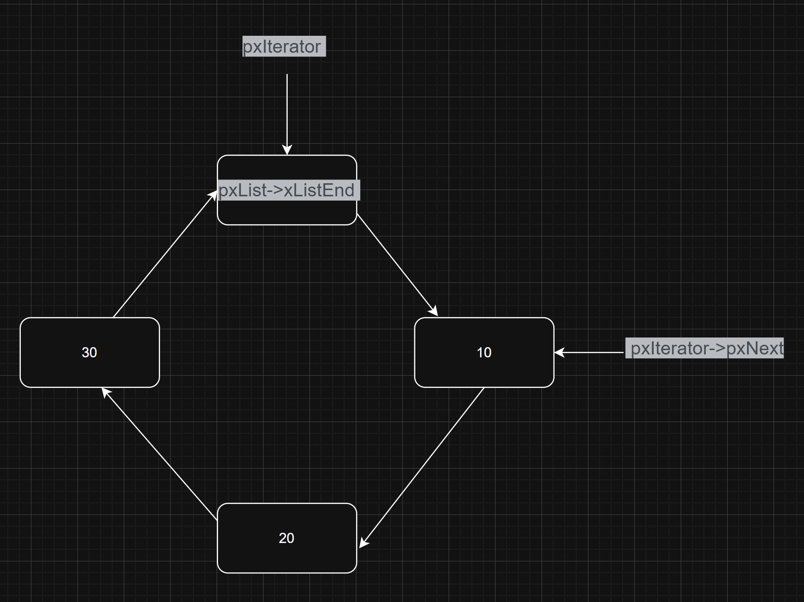
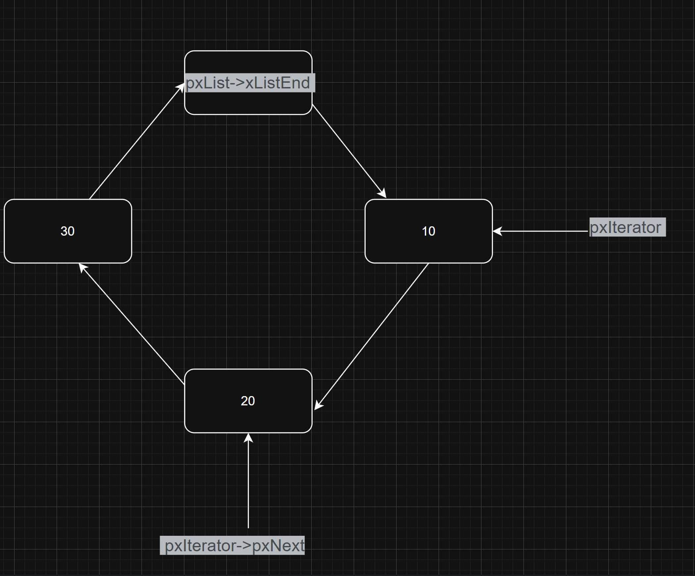

# vListInsert 函数分析笔记

## 函数功能

**vListInsert 的功能是将一个列表项按 xItemValue 升序插入到指定链表中，若值为最大值则直接尾插，升序目的是查找的时候更高效**

这里以插入延时列表为例

## 源代码

```c
void vListInsert( List_t * const pxList, ListItem_t * const pxNewListItem )
{

ListItem_t *pxIterator;

const TickType_t xValueOfInsertion = pxNewListItem->xItemValue;

  if( xValueOfInsertion == portMAX_DELAY )
  {
    pxIterator = pxList->xListEnd.pxPrevious;
  }
  else
  {
    for( pxIterator = ( ListItem_t * ) &( pxList->xListEnd ); pxIterator->pxNext->xItemValue <= xValueOfInsertion; pxIterator = pxIterator->pxNext ) 
    {
      /* There is nothing to do here, just iterating to the wanted
      insertion position. */
    }
  }
  pxNewListItem->pxNext = pxIterator->pxNext;

  pxNewListItem->pxNext->pxPrevious = pxNewListItem;

  pxNewListItem->pxPrevious = pxIterator;

  pxIterator->pxNext = pxNewListItem;

  /* Remember which list the item is in.  This allows fast removal of the

  item later. */

  pxNewListItem->pxContainer = pxList;

  ( pxList->uxNumberOfItems )++;

}
```

## 参数说明

第一个参数是要插入的列表，第二个参数是需要插入的节点

## 代码分析

### 一、变量定义

```c
ListItem_t *pxIterator;
```

先定义了一个列表的节点

```c
const TickType_t xValueOfInsertion = pxNewListItem->xItemValue;
```

把插入列表的节点的xItemValue赋值给xValueOfInsertion,其在这里是存储需要插入的链表的唤醒时间

注 ：xItemValue不一定存储的是任务的唤醒时间，延时列表是唤醒时间，在就绪列表就是任务优先级了

portMAX_DELAY 是无符号32位最大的数

```c
#define portMAX_DELAY ( TickType_t ) 0xffffffffUL 
```

### 二、判断分支

```c
if( xValueOfInsertion == portMAX_DELAY )
{
    pxIterator = pxList->xListEnd.pxPrevious;
}
```

这个判断先跳过，先看else的内容

### 三、else分支详解


#### 1. for循环

```c
for( pxIterator = ( ListItem_t * ) &( pxList->xListEnd ); pxIterator->pxNext->xItemValue <= xValueOfInsertion; pxIterator = pxIterator->pxNext )
```

这是一个空的for循环，目的是为了根据延时时间进行排序，之前在延时函数的理解里面写过`vListInsert 就是根据唤醒时间将任务升序插入到阻塞列表`,其中升序就是靠这个循环实现的

#### 2. 循环起始位置

pxIterator = ( ListItem_t * ) &( pxList->xListEnd );将节点指针指向最末尾的节点（准确来说是一个哨兵节点，并不存储数据），所有的列表在初始化时都通过`pxList->xListEnd.xItemValue = portMAX_DELAY;`初始化为了portMAX_DELAY 

#### 3. 循环判断条件

pxIterator->pxNext->xItemValue <= xValueOfInsertion;因为列表是双向循环链表，这里将pxIterator指针指向的节点的延时结束时间与需要插入的节点延时结束时间相比较，如果小于或者等于的话就pxIterator = pxIterator->pxNext，就移动指针指向下一个节点，如果大于，指针就不再向下移动

这里判断加上`= xValueOfInsertion`保证在同等唤醒时间的条件下，后进来的总是会比先进来的后执行，遵循了先进先出FIFO

#### 4. 图示说明



上图是初始状态，假如现在我插入的节点的延时结束时间是15，那下一步发现pxIterator->pxNex的延时时间比插入节点xItemValue 小，移动指针到下一个节点



然后再次比较下一个节点，发现比插入节点大，于是指针停止移动，停留在10的位置，然后将新节点插入10和20之间


所以说，这个for循环就是遍历根据延时时间的大小找到合适插入位置，保证链表升序

### 四、哨兵节点的作用

至于为什么需要pxList->xListEnd这个不存储数据的节点，这是因为需要一个绝对不变的基准提供统一的遍历起点和终点，方便从这里进行升序排列

更重要的是保证else分支的for循环不会死循环，for循环存在<= xValueOfInsertion的判断，如果没有这个最大值保底，而且整个链表节点的唤醒时间都比xValueOfInsertion小，判断会一直成立，又因为这是循环链表，所以就会一直循环，程序在这里就会卡死

### 五、分支优化分析

看完这里后，我们再回过头看if分支的代码

```c
if( xValueOfInsertion == portMAX_DELAY )
{
    pxIterator = pxList->xListEnd.pxPrevious;
}
```

这个分支只在延时列表中有用，因为就绪列表的优先级永远不会等于portMAX_DELAY，默认是56

这个是判断当前延时结束时间是不是和portMAX_DELAY这个最大值相等，如果相等，让 `pxIterator` 指向最后一个有效节点（即哨兵节点的前一个节点，有效节点的后一个），新节点将插在它和哨兵节点之间

单独if分支处理是逻辑上的必要处理，因为else分支的for循环判断是 <= xValueOfInsertion，主要就是这个等于号的问题，当新插入的节点的唤醒时间是最大值时，列表中没有节点比这个新节点更大，所以这个for循环会一直成立，结果就是死循环卡在这里了

### 六、节点插入操作

```c
// 假设 pxIterator 指向 A，A->pxNext 指向 B，要在 A 和 B 之间插入 C
pxNewListItem->pxNext = pxIterator->pxNext;         // 1. C->pxNext = B（新节点连上后面的 B）
pxNewListItem->pxNext->pxPrevious = pxNewListItem;  // 2. B->pxPrevious = C（后面的 B 连回 C）
pxNewListItem->pxPrevious = pxIterator;             // 3. C->pxPrevious = A（新节点连上前面的 A）
pxIterator->pxNext = pxNewListItem;                 // 4. A->pxNext = C（前面的 A 连上 C）
// 顺序不能乱：必须先完成 C 和 B 的双向链接，再处理 A 和 C，否则会丢失 B 的地址
```

上面找到了插入位置，下一步是插入，常规的节点插入操作，只需要注意插入需要先连后面在断前面

### 七、收尾工作

```c
pxNewListItem->pxContainer = pxList;
( pxList->uxNumberOfItems )++;
```

上面是让节点知道自己插入的是什么列表

下面是链表节点数量+1

## 总结

vListInsert 就是在一个双向循环链表中做升序插入，特殊之处在于用 xListEnd 作为哨兵节点，并用 == portMAX_DELAY 的分支处理了边界问题

