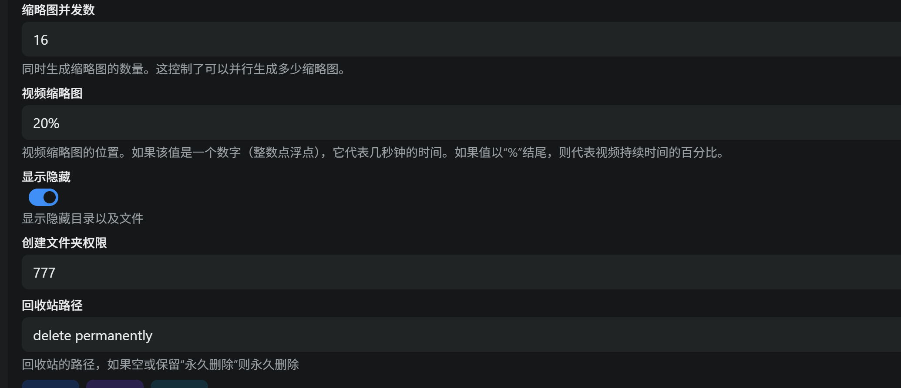
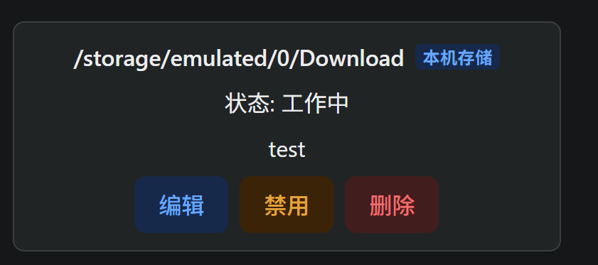
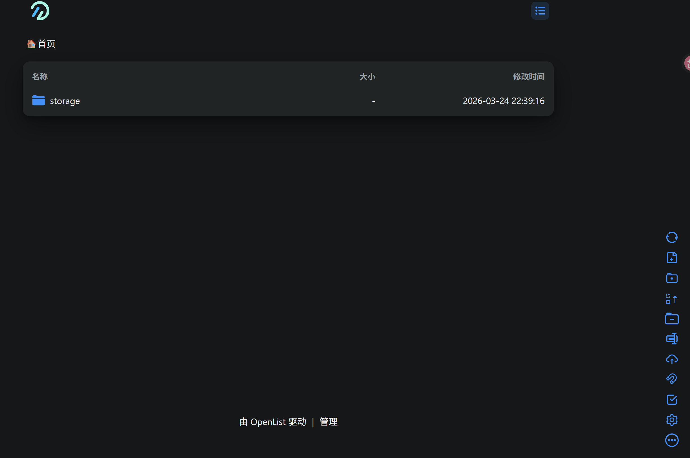
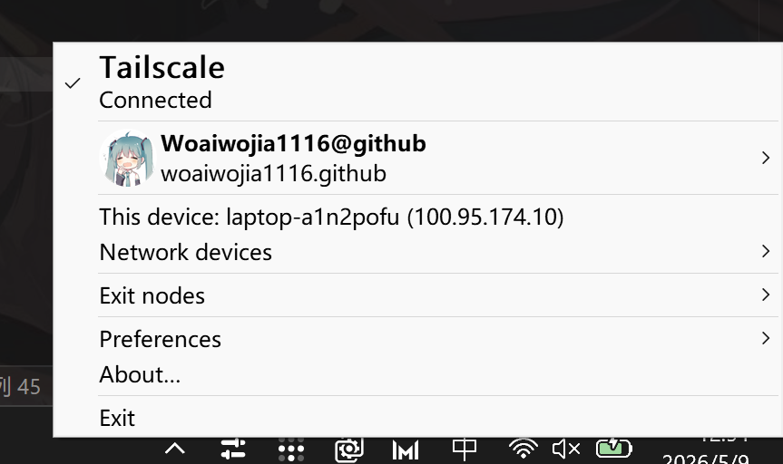
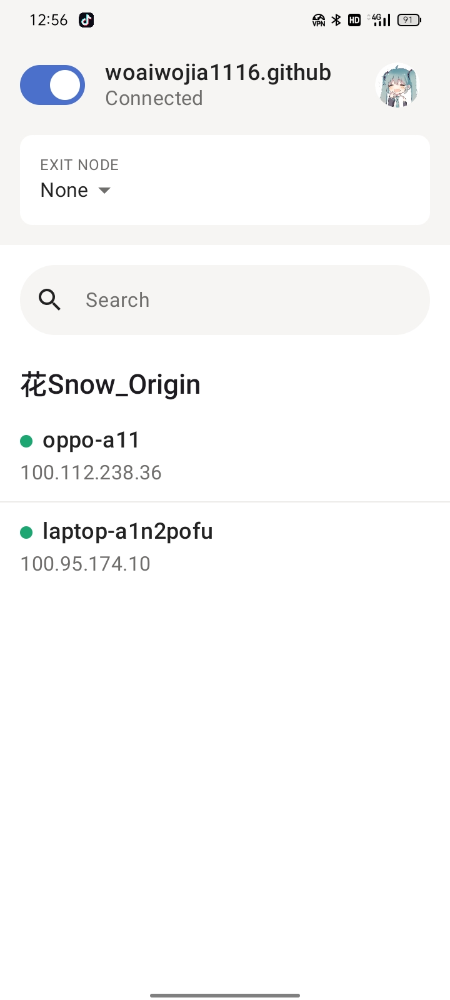

# 										使用旧手机实现NAS


本教程将会带领你使用手头的旧手机，零成本建一个自己的私人云盘

**所需设备**:一台安卓手机（只能是安卓的哦），另外一台能开机的设备


**实现的手段** termux + alist


## 一、安装termux

termux是一个运行在 Android 系统上的终端模拟器，能模拟linux环境

推荐从github上或者F-Droid上下载

## 二、安装alist


Alist 是一个支持多种存储的文件列表程序，旨在方便用户管理文件。它可以将多个网盘（如阿里云盘、OneDrive、Google Drive等）聚合在一起，支持网页浏览和 WebDAV，用户可以轻松访问和管理存储在不同平台上的文件。Alist 以其简洁的界面和易于部署的特点而受到欢迎，适合个人和服务器使用。

alist官方网址：`https://alistgo.com/zh`

准备安装alist
打开Termux，更新软件源并安装AList：
```
pkg update -y && pkg upgrade -y
pkg install alist -y
```

## 三、查看ip地址

在做这一步之前确保两台设备连接在同一个网络下哦

termux上运行`ip addr`
如果不显示IP,请根据提示安装相应工具后再次尝试

在输出信息中找到`inet`后面的地址，记下来

## 四、运行alist

### 4.1 授予访问文件的权限

在运行之前，我们需要先授予termux访问权限，毕竟是把手机当作云盘，占用手机的磁盘

运行`termux-setup-storage`授予权限，在弹出的对话框点击允许，然后退出termux清理后台重新进入使之生效

然后运行`ls ~/storage/downloads`

如果有文件正常输出，说明权限没问题，如果输出中有`Permission denied`，说明权限有问题
在设置中找到termux关闭访问文件的权限，在termux终端里输入`rm -rf ~/storage`删除创建的符号链接

再次执行`termux-setup-storage`

### 4.2 正式运行alist

执行`alist server`启动服务，第一次会自动生成密码，这里不用管
接下来使用
```
alist admin set 你的新密码
```
修改密码，修改成功后会输出你的用户名和密码，务必记下来

## 五、 在另一台设备上使用浏览器访问

***访问前务必连接同一个网络***

在浏览器中输入`http://手机IP:5244`，会进入openlist的登陆界面，输入账户名和密码，账户名默认admin

点击界面下方的`管理`,进入openlist的管理界面

## 六、 openlist设置

进入后台后，点击左边 `存储`

点击`添加`

驱动搜索`本机存储`选择

挂载路径选择你手机上文件想要存储文件的路径，这里不清楚的可以下载`mt管理器`查看手机上的文件

我这里填写`/storage/emulated/0/Download`

其他的保持默认即可


这里的777学过Linux的应该很熟悉吧，可以按照自己想法设立权限，但是在这里没有必要

最后点击导入，退出发现这里出现了刚刚导入的存储


## 七、 导入文件

点击左侧`首页`，可以看到有个文件夹


然后右下角是各种操作，小伙伴们自行尝试

这部操作如果显示包含`Permission denied`的英文，请回到termux重新执行4.1步操作

## 八、 使用内网穿透工具实现外部访问

上面的操作都是在同一个wifi下才的实现访问，我们这里采用`Tailscale`来实现外部访问

这个需要设备间都下载`Tailscale`这个工具，同时这个工具需要同一个github账号登录



手机上推荐从F-Droid上下载

下载完成且登录号账号后会分配内网的虚拟IP，显示处于内网的设备，如下


然后之后便可以不出在同一个wifi下，在浏览器输入`https://虚拟IP:5244`或者`https://设备名:5244`也可以实现访问了

然后就可以随心所欲上传文件到手机上了，实现了私人云盘

## 九、 注意事项

1. 为了防止安卓手机杀掉termux和tailscale的后台使得访问断开，需要在手机设置中让他们持续在后台运行

2. 这个不建议当作主力NAS来使用，毕竟不是专业的NAS，手机长期运行肯定要插电，长期处于充满会导致电池鼓包，而且频繁读取写入肯定会对手机的存储寿命造成影响


