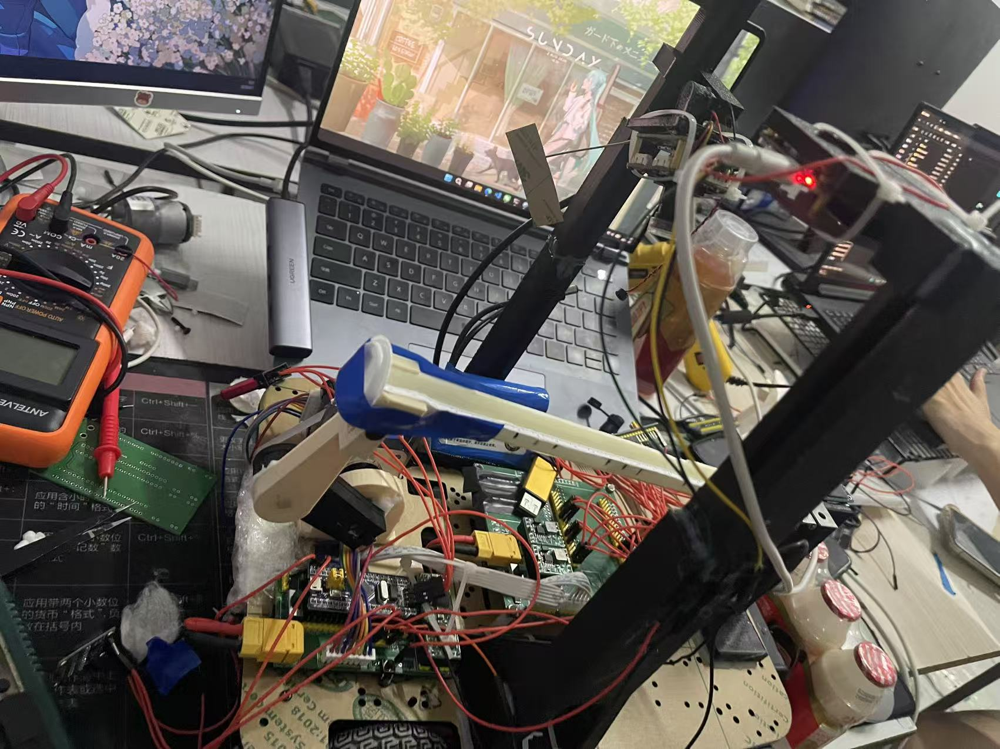
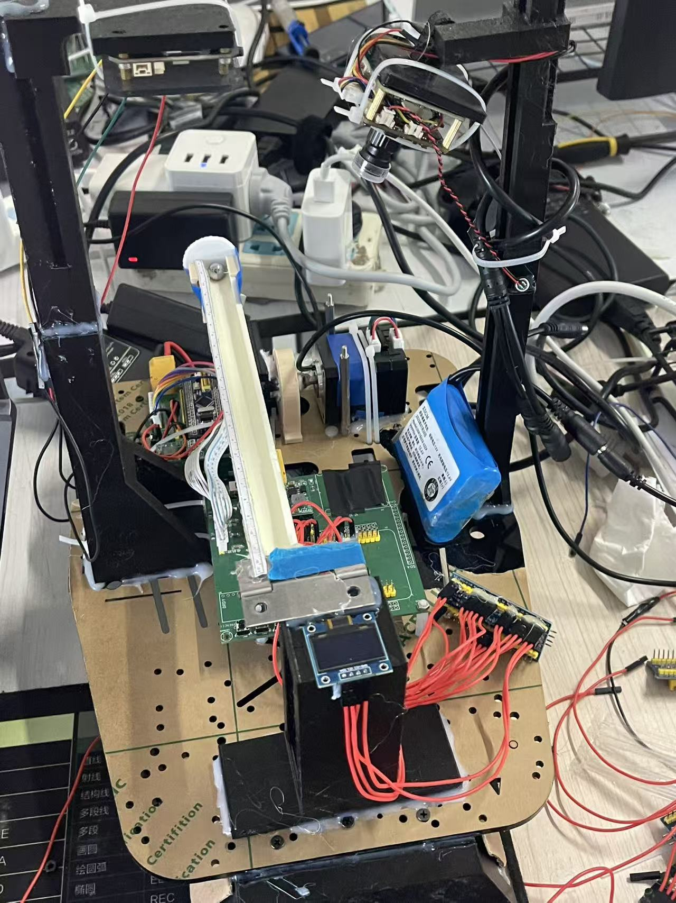

# 电赛寄录

> 四天三夜，睡了十二个小时，还把第一次通宵给了它

---

## 写在前面

先说说我们这支队伍——三个大一，我负责主控（会一点STM32和M0），队友一个做视觉兼报告，一个搞硬件

说实话，赛前一个月的准备并不算充分。五月中旬我刚把平衡车调通，算是第一次真正用上PID；队友一个刚开始学32，一个刚开始画PCB和SolidWorks。而我在那段时间，净折腾这个网站和看FreeRTOS源码去了……

现在回头看，那些拖延的日子，都在比赛里还了回来

---

## 赛前

我们原本打算拿25年的E题练手。六月底开始写小车和云台的代码——小车用M0，云台用STM32

小车的模块调试还算顺利：灰度、陀螺仪、OLED，一个一个验证。云台那边也穿插着写

**然后硬件开始出问题了。**

第一版PCB，封装画错了，用不了

我当时竟然觉得时间还够，让硬件队友继续改。这一改，直接拖到了7月20号左右

板子到了，上电——LED不亮。检查发现降压模块封装画反了，正负极接反，直接把电源线烧断了，最后只能换板子然后飞线勉强用。好在我代码之前就写好了，烧进去调一下速度环和循迹环参数就差不多了

那时候已经是7月24号。清单都出来了，我们也没时间把25年的题完整做一遍

哎，第二天小车跑了一圈，再烧录就烧不进去了——芯片烧了。可能是电机驱动电流回灌，一点保护都没做。只能等新板子

---

## 比赛

赛题公布，我们选了H题

29号上午，我们刚换完小车底板，想着还是用m0先试试，调了一个上午没啥问题，中午莫名其妙**M0又烧了**

没招了，当场放弃M0，转战STM32

花了几个小时把代码移植过来，让硬件队友去焊洞洞板

焊洞洞板**这是我整个比赛最后悔的决定**，因为很多飞线焊好的概率确实不大，而我明明知道却抱着侥幸心理，是我的问题了

队友焊了一下午加一晚上，我这边和视觉讨论通信逻辑，把小球平衡的代码框架搭了出来，然后去睡了一会，等硬件焊好板子

拿到板子一调——果然有问题，电机驱动发烫，线太乱找不到问题，也是果断放弃找问题，去换方案了，总的来说，一天多了，啥都没做成

说实话，那时候我已经想弃赛了

第二天小车新板子到了——虽然是给M0分配的引脚，但没办法，我们没有把握继续用m0会不会继续烧，于是打算用杜邦线连32用

晚上硬件准备好了，调软件遇见**编码器读不出数据**，排查半天，一开始以为是杜邦线的问题，后来换了线还是不行，查软件，改代码，编码器能读出来数也是明显不正确的数据

实在找不出原因，我决定开环硬写

没想到，开环效果竟然还不错。调了几个小时，算是能跑了

中间睡了一觉，起来开始搞机械结构——硬件队友建模打印，我完善平衡代码

3D打印件出来了，视觉用固定视角训了一个新YOLO模型，效果不错，坐标跟得上小球速度

我开始写平衡逻辑，用的是张大头的步进电机

一开始用速度闭环，效果很差——电机一直输出，机械结构都快拧坏了。不敢多调，换成了位置闭环，但是发现只是有平衡的趋势，但是效果不是很好，
之后查资料，知道还有前馈这个说法，加上前馈后，发现效果好上不少，但是还是会出现颠勺的情况，之后看到学长组的那个很平滑，并不会出现我们的抖动的情况，后来我给PID的输出加上低通滤波之后，也实现平滑的效果

之后慢慢调，发现全部管子用一套PID并不行，中间和两侧需要两套PID，也是很麻烦

当时在跳出来中点平衡的时候还是挺兴奋的，当时是在半夜一点多了，直接不困了，但是又调了一会，兴奋感褪去直接困的不行了，睡了三个小时，继续干

之后就是慢慢调PID......

---

## 测评 · 遗憾收尾

测评现场，一言难尽

图传现场出了问题，根本找不到图传的热点，只能放弃了。第二问完美完成

**第三问出了大问题。** 机械结构没固定好，上电就滑下来了。我们设了4秒延时启动摄像头，但我的代码逻辑是一上电就开始第三问。摄像头没启动的这段时间，全靠电机硬扛，而结构是松的，刚上电电机还没稳住，它就往下歪了，小球直接掉下来

评测的老师直接判定失败

但我现在回想——**摄像头还没启动，计时都还没开始，凭什么算失败？** 当时脑子抽了，竟然没反应过来。但是都过去了，归根结底还是我们的问题

后面4、5、6问大差不差，唯一的问题是**启动补偿没加上**，导致一开始就偏了5cm，后面时间和平衡误差其实都没问题

是我当时飘了，想把第六问做出来之后再去做，结果做完快比赛快结束了，我脑子抽风了，把这个忘了，我的问题

看这样子，奖应该是拿不到了（出来了，没奖）

---

## 最后

遗憾啊，真的很不甘心，但这趟下来，我学到不少。硬件的坑，代码的坑，配合的坑，全踩了一遍

队友都很给力，明年再战

附两张我们的小车吧

---

*2026年8月5日，赛后记*