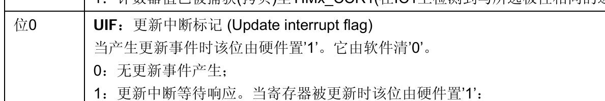
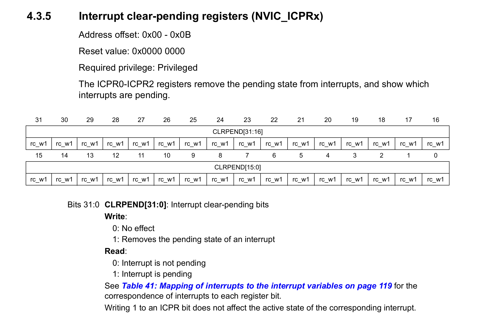
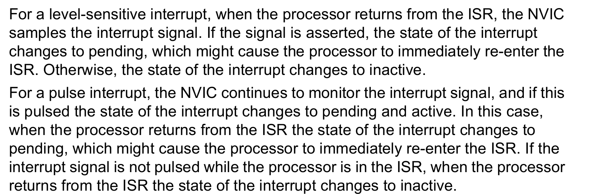
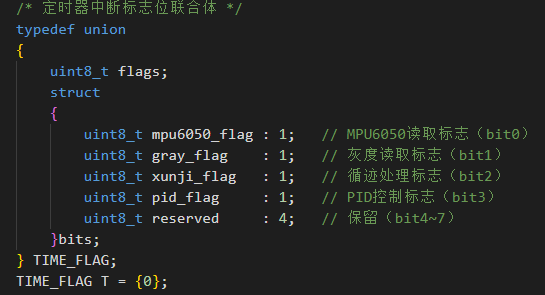

> 一次 ISR 超时导致的“假死”故障排查实录

---

## 结论先行

在程序执行的时候，中断服务函数（ISR）的执行时间，必须小于该中断的触发周期，否则 NVIC 的挂起位（Pending Bit）会在你清除标志位之后又被重新置 1，导致 CPU 刚退出中断又立刻被拉回来，形成中断死循环，无法执行主循环任务

---

## 踩坑实录

> 先说现象：注释掉定时器中断里的 MPU6050 读取，串口就能发数据；不注释就不行。问题就出在 MPU6050 读取这块
>
> 按理说 MPU6050 的代码是从 STM32 那边直接搬过来的，之前跑得好好的，不应该有问题。但既然现象指向它，先查硬件，以我杜邦线仙人的实力，接线确实没毛病。再换网上的代码试，也不行，折腾一圈，MPU6050 本身的代码应该是干净的
>
> 那就上调试器。在串口发送和 MPU6050 读取两边打断点，发现程序压根跑不出定时器中断。第一反应是中断标志位没清，标准库的 case 语句会不会没自动清？手动清了一下，涛声依旧
>
> 这时候瞄了一眼读出来的数据，yaw/pitch/roll 居然都有值，说明 MPU6050 其实在工作。那问题就蹊跷了——传感器没挂，代码没问题，标志位也清了，怎么就死中断里出不来

> 转念一想，软件 I2C 是逐位操作的，读一次 MPU6050 花的时间可不少。再看定时器周期——1ms。突然就通了，这俩一撞，必死

于是乎，排查出了是定时器中断中任务时间过长的问题，这个其实在多半年前学51的时候就强调过了，但是没有踩坑，没有很在意，这次事教人教会我了，也反映了之前做的平衡车并没有完全吸收

---

## 原理分析

在这里解释一下为什么定时器中断中任务时间长于定时器中断时间为什么会导致程序卡死

首先需要了解两个寄存器

- TIM 的 SR 寄存器的位 0，UIF，如果产生更新中断，便会将这一位置为 1，这一位需要软件清除，我们暂且叫它**中断发生标志位**

  

- 还有一个是 NVIC 的 ICPR 寄存器，这个会给对应中断置一个挂起的状态，我们暂且叫它**挂起位**

  

众所周知，所有的中断都需要经过 NVIC 的处理，定时器中断也是。TIM 的 SR 寄存器的位 0，UIF 置为 1 的时候会向 NVIC 发起请求，挂起 NVIC 的 ICPR 寄存器的相应位为 1，CPU 通过这一位来判断要不要进入相应的中断

在正常情况下，定时器中断时间到执行上面一步置两个标志位为 1，进入中断，执行任务，然后手动清除标志位（这个标志位就是上面说的中断发生标志位），然后退出

至于挂起位，我们可以看到手册里面写了这个是在进去中断函数的时候由硬件清除的

  

但是如果定时器中断中的任务执行时间长于定时器中断的时间，比如定时器中断 1ms，里面的任务执行 3ms：

在任务执行到 1ms 的时候，定时器中断发生，但是任务还在执行，还在中断中运行。到 3ms 的时候，任务结束，也手动清除了中断发生标志位，那会不会跳出中断函数去干其他事情呢

有小伙伴可能想了，硬件清除 NVIC 的标志位，软件清除外设的标志位，不都清除了吗，这不是就能跳出中断函数了吗

这就要看上面这段话发生的时机了

> “在任务执行到 1ms 的时候，定时器中断发生，但是任务还在执行，还在中断中运行”

在这个时候，如果发生中断，会再次导致 NVIC 的 ICPR 寄存器的相应位重新置为 1，然后在任务结束的时候，CPU 一检查发现仍为 1，就再次进入中断函数

这便是定时器中断中任务时间长于定时器中断时间会导致程序卡死的原因

下图是手册描述，NVIC 会持续监测中断引起的变化

NVIC 的挂起位（Pending）在 ISR 执行期间并不会被屏蔽。只要外设的中断标志位在 ISR 返回前再次被置 1，NVIC 就会重新挂起该中断，即使当前正在执行同一个中断服务函数

  

---

## 生活类比（外卖员、门卫大爷和你）

这里打个比方

- 你是 CPU
- 小区门卫大爷是 NVIC
- 外卖员是外设

外卖员进不去小区，外卖需要通过大爷来交给你

### 正常流程

外卖员到了小区（外设产生中断事件，比如定时器溢出）

外卖员进不去小区（外设不能直接通知 CPU），所以他在小区门口喊大爷（外设的中断标志位 Flag 置 1）

大爷听到喊他（NVIC 检测到外设的 Flag = 1）

大爷在表上记一笔：“某某号楼的业主有外卖到了”（NVIC 的挂起位 Pending 置 1）

大爷喊你：“你的外卖到了，下来拿！”（CPU 响应中断，准备执行 ISR）

你听到喊声，往楼下走（CPU 开始进入中断服务函数）

就在你走出房门的那一刻，大爷把表上你的名字划掉了（硬件自动清除 NVIC 挂起位）

你下楼拿到外卖，但是你还不能回房间——因为外卖员还在门口等着，你得对外卖员说一句“我拿到了，你走吧”（你在 ISR 里手动清除外设的中断标志位 Flag）

如果不跟外卖员说这句话，外卖员会以为你没收到，一直压力大爷（中断发生标志位一直为 1），大爷又得记、又得喊你，形成死循环

你回房间继续做自己的事（CPU 返回主循环）

---

### 异常情况（中断执行时间 > 中断周期）

第一个外卖员到了（第一次中断），大爷记上，喊你下楼，你赶紧说下来了，大爷把你名字划掉了（硬件自动清除 NVIC 挂起位）

你下楼磨磨蹭蹭（中断函数执行时间长），外卖员不耐烦，和大爷抱怨你好几次（中断反复触发）

大爷本来已经划掉你名字了，但是看你还不下来，外卖员又催（任务执行期间发生中断），于是又写上你的名字

你终于走到门口，拿了外卖，跟外卖员说“收到了”（清中断发生标志位），回房间

但是大爷年纪大了，这个刚写的忘了划掉（其实严格来说是大爷只在告诉你的时候会划掉，但是感觉这样说成规则怪谈了）

于是，在你刚到家的时候大爷又喊你……你刚回房间又得下楼，永远没法休息（程序卡死）

> 注：对于异常情况这个比喻其实不太合理，理解意思即可，多多担待

---

所以在中断中，只要退出的时候 TIM 的 SR 寄存器的位 0，UIF 和 NVIC 的 ICPR 寄存器的相应位都为 0，就肯定能够退出
只要注意中断中不要执行长时间的任务，可以通过中断只置标志位，主循环判断标志位来处理

我最终是用了联合体通过位操作给不同任务置位来避免中断长时间操作的

> 参考文献 
>
> STM32F10xxx Cortex-M3编程手册

