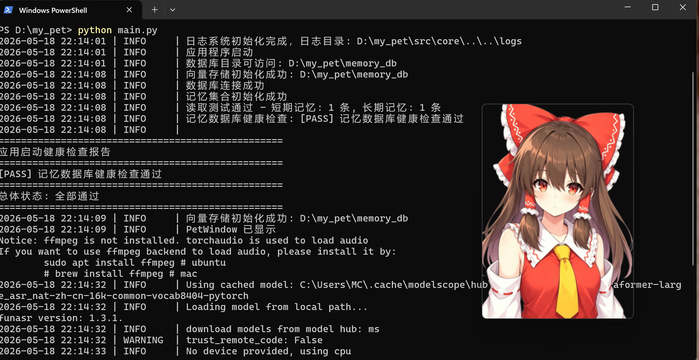
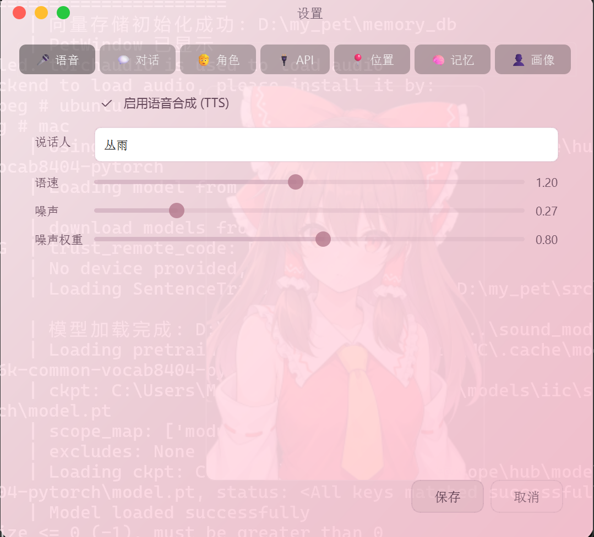

#                                   记录我的第一次vibecoding制作桌宠

##  一、 为什么想要vibecoding
vibecoding这个词在我印象里似乎是近几个月才出现的。

我是电子类的学生，写单片机的代码时总是不放心把代码全交给AI去写，所以一直没有尝试vibecoding这种编程模式，至于这次为什么想要去接触一下呢，这就要说一下我最近在干什么了

我近一段时间为了准备电赛去把玩了一下mspm0的板子，不知道是我学stm32时技术深度不够还是m0配置不理解，去配置m0板子的时候问题比较多，真的给我整破防了，编码器中断，外部中断死活进不去，查半天查不出原因，导致直接不想干了。然后又闲的没事干，于是想去尝试一下vibecoding（别问为什么我还有精力去搞这个，因为我们没有校赛，没有压力doge），因为之前在github上看见过一个名叫airi的项目，说是对标牛肉sama，很感兴趣，所以这次vibecoding就把目标放在桌宠上面了。

## 二、 我是怎么开始制作的
我一开始的想法是做出能够文本对话，输出特定角色的声音，然后支持直接对话的那种桌宠。其实一开始没打算全部去让AI写，于是先去学了一下图形库pyqt，选择这个是因为是qt，而我之后也肯定会接触C++版的qt，所以打算提前了解一下，但是学了一点我发现，自己学的话制作周期会非常长，而我没有长周期的时间去以玩的心态去做出这个东西，于是果断放弃，直接上手让AI去做。本来想使用claude接入deeoseek的，但是想想是第一次，不想花钱，于是选择了opencode上的免费模型（感谢opencode，学生党福音/(ㄒoㄒ)/~~）

## 三、 制作过程
开始做的时候就是直接用自然语言描述你想要实现的效果，比如添加右键弹窗“添加右键弹出弹窗功能，弹窗显示对话按键，点击对话按键弹出对话框界面”。这样AI基本上就能做出个大概，但是对话框的样式必须之后详细描述你想要的是什么样子的，让AI不断完善，才能做出和想想中差不多的对话框，做好前置工作后，就直接和AI说接入API调用的功能，对话时直接调用API生成回复，这一步没有多说什么AI做的很好

这时候目前仅仅是一张图片，对话时太单调，就借鉴galgame，对话时让AI根据prompt改变图片，根据情感改变图片，不过这样效果非常差，不过暂时也没有什么改进方案，来来回回都是prompt，所以我暂时搁置了这个功能，之后添加语音输出的功能，我一开始是打算使用GPT-SoVITS微调一个小一点的模型仿照出博丽灵梦的声音的，但是发现对硬件配置太高了，看看云端发现要好几块一个小时，自己也没有使用GPT-SoVITS的经验于是放弃了，之后花时间去Hugging Face直接找了下载了一个别人训练好的模型文件（不过是VITS的），之后自己按照推理AI提示去配置怎么使用，让AI去给方案我自己去配置，之后折腾了不少时间，没搞好，这一步我突然开窍😎，我之前需要配置环境还是各种东西都习惯自己折腾了，现在这个也可以让AI去帮我做啊，于是果断将这个交给AI去做，等了不少时间，也是成功输出语音了。

之后也就是让AI不断去完善，增加功能，让AI去查找项目的缺陷，然后自己迭代，嗯...，就是这样，就不写流水账了，连续做了五天，做出了比较完善的成品，基础的对话功能已经实现，也和预期的效果相差不大，展示一下吧

## 四、 效果展示

也增加了设置功能，能够方便的修改某些选项

目前最差的是记忆功能，还很不好，仅仅是靠简单的prompt，短期记忆+长期记忆来实现记忆某些特定内容，效果不太行，使用体验下来，记忆才是桌宠的核心，没有记忆真的没什么意思，还不如去酒馆玩，不过酒馆挺烧钱的，之前玩上瘾了，玩了一天，同样的deepseek的模型，花了好几块钱，而我现在这个对话了三四天，也就花了两毛钱，还是很实惠的，梁佬的恩情不能忘记😭

## 五、 感悟
vibecoding降低了开发的门槛，让我这个什么也不会的人能做出来这种东西。但是新手使用感觉像是猴子拿到了枪，我在使用发现vibecoding编写出来的代码安全问题很大，比如在不刻意强调的前提下，APi密钥是在文件里面硬编码直接显示的，而且没有.gitignore文件，如果不注意，直接把API key就提交到github上了，那就直接把密钥开源了，当上慈善家了😀

vibecoding降低了个人创作的门槛，但是安全意识的门槛仍然存在，不去审查自己代码是很不负责任的行为，不过对于猴子来说，它们并不知道枪能够伤人

第一次尝试vibecoding也是有了很好的产出，什么都不会还能做出来能聊天的桌宠，还是很不错的。不过玩了几天这个，还是要回去接收m0的折磨了🫡
